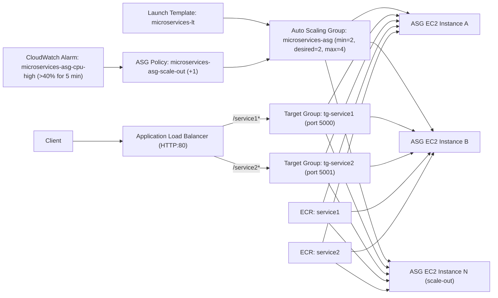

# AWS Microservices Deployment (DevOps Interview Assessment)

## Overview
This project deploys two containerized Flask microservices to AWS using:
- Amazon ECR for image storage
- EC2 instances for runtime (core: manual instances, bonus: ASG-managed instances)
- Application Load Balancer (ALB) with path-based routing
- A Python verification script for endpoint and ECR checks

## AWS Region
- Region used: `us-east-1`

## Architecture


## Implemented Resources
- ECR repositories
- EC2 instances:
- Security groups:
  - `alb-sg` for public ALB ingress on port `80`
  - `ec2-sg` for `22` (my IP) and app ports `5000/5001` from `alb-sg`
- ALB:
  - Name: `microservices-alb`
  - DNS: `microservices-alb-1788265787.us-east-1.elb.amazonaws.com`
- Target groups:
  - `tg-service1` -> HTTP `5000`, health check `/health`
  - `tg-service2` -> HTTP `5001`, health check `/health`
- Bonus resources (Terraform):
  - Launch Template: `microservices-lt`
  - Auto Scaling Group: `microservices-asg` (`min=2`, `desired=2`, `max=4`)
  - Scale-out policy: `microservices-asg-scale-out`
  - CloudWatch alarm: `microservices-asg-cpu-high`

## IAM Permissions Used
### EC2 instance role (runtime)
- Role name: `ec2-ecr-pull-role`
- Attached policy: `AmazonEC2ContainerRegistryReadOnly`
- Why this is needed:
  - Allows EC2 instances to authenticate to ECR and pull container images securely without storing long-lived access keys on the server.

### Deployment identity (CLI user)
- IAM user: `cli`
- Core policies used:
  - `AmazonEC2ContainerRegistryFullAccess`
    - Needed to create ECR repositories, push images, and query repository/image metadata.
  - `AmazonEC2FullAccess`
    - Needed to launch/manage EC2 instances and related instance-level operations.
  - `ElasticLoadBalancingFullAccess`
    - Needed to create/manage ALB, target groups, listeners, and listener rules.
  - `IAMFullAccess` (temporary for setup)
    - Needed to create and attach the EC2 instance role/profile used for ECR pull access.

### Bonus policies (for ASG auto scaling)
- `AutoScalingFullAccess`
  - Needed to create and manage Launch Template/Auto Scaling Group and scaling policies.
- `CloudWatchFullAccess`
  - Needed to configure/view CPU-based alarms and monitoring evidence for scale-out validation.

### Note
- `IAMFullAccess` and other broad policies were used as time-boxed interview setup permissions.
- After completion, these can be tightened to custom least-privilege policies scoped to only required actions/resources.

## Deployment Steps
### 1) Build and push images to ECR
From `servers/`:

```bash
export AWS_REGION=us-east-1
export AWS_ACCOUNT_ID=378834093760

aws ecr get-login-password --region "$AWS_REGION" \
| docker login --username AWS --password-stdin "$AWS_ACCOUNT_ID.dkr.ecr.$AWS_REGION.amazonaws.com"

docker buildx build --platform linux/amd64 -t service1:latest ./service1 --load
docker buildx build --platform linux/amd64 -t service2:latest ./service2 --load

docker tag service1:latest "$AWS_ACCOUNT_ID.dkr.ecr.$AWS_REGION.amazonaws.com/service1:latest"
docker tag service2:latest "$AWS_ACCOUNT_ID.dkr.ecr.$AWS_REGION.amazonaws.com/service2:latest"

docker push "$AWS_ACCOUNT_ID.dkr.ecr.$AWS_REGION.amazonaws.com/service1:latest"
docker push "$AWS_ACCOUNT_ID.dkr.ecr.$AWS_REGION.amazonaws.com/service2:latest"
```

### 2) Deploy on both EC2 instances
On each instance:

```bash
sudo apt-get update -y
sudo apt-get install -y docker.io curl unzip
sudo systemctl enable --now docker

curl -fsSL "https://awscli.amazonaws.com/awscli-exe-linux-x86_64.zip" -o awscliv2.zip
unzip -q awscliv2.zip
sudo ./aws/install --update

mkdir -p ~/.docker/cli-plugins
curl -SL "https://github.com/docker/compose/releases/download/v2.27.0/docker-compose-linux-x86_64" -o ~/.docker/cli-plugins/docker-compose
chmod +x ~/.docker/cli-plugins/docker-compose

aws ecr get-login-password --region us-east-1 \
| docker login --username AWS --password-stdin 378834093760.dkr.ecr.us-east-1.amazonaws.com
```

Create `/opt/microservices/docker-compose.yml`:

```yaml
version: "3.8"
services:
  service1:
    image: 378834093760.dkr.ecr.us-east-1.amazonaws.com/service1:latest
    ports:
      - "5000:5000"
    restart: always
  service2:
    image: 378834093760.dkr.ecr.us-east-1.amazonaws.com/service2:latest
    ports:
      - "5001:5001"
    restart: always
```

Run:

```bash
cd /opt/microservices
docker compose up -d
docker ps
curl -s http://localhost:5000/health
curl -s http://localhost:5001/health
```

### 3) ALB and routing
- Created `tg-service1` (port `5000`, health `/health`) and `tg-service2` (port `5001`, health `/health`)
- Registered both EC2 instances in both target groups
- Created `microservices-alb` with HTTP listener on `80`
- Added listener rules:
  - `/service1*` -> `tg-service1`
  - `/service2*` -> `tg-service2`

### 4) Bonus (Terraform IaC)
Terraform code is included under `terraform/` and was applied to provision:
- Launch Template (`microservices-lt`) with user-data bootstrap for Docker + ECR + Compose
- Auto Scaling Group (`microservices-asg`) with `min=2`, `desired=2`, `max=4`
- ASG attachment to existing target groups (`tg-service1`, `tg-service2`)
- CPU alarm + scale-out policy (`>40%` for 5 minutes)

Commands used:

```bash
cd terraform
cp terraform.tfvars.example terraform.tfvars
terraform init
terraform plan
terraform apply
terraform output
```

## Verification Script
Script path:
- `servers/verify_endpoints.py`

Default values in script:
- `ALB_DNS = microservices-alb-1788265787.us-east-1.elb.amazonaws.com`
- `REGION = us-east-1`

Run from repo root:

```bash
python3 servers/verify_endpoints.py
```

Optional override:

```bash
python3 servers/verify_endpoints.py <alb-dns> <region>
```

## Screenshots (Output)
### 1) ECR repository images


### 2) docker ps on both EC2 instances


### 3) ALB DNS + curl responses
Commands used:

```bash
export ALB_DNS=microservices-alb-1788265787.us-east-1.elb.amazonaws.com
echo "$ALB_DNS"
curl -s "http://$ALB_DNS/service1"
curl -s "http://$ALB_DNS/service2"
```


### 4) Bonus evidence: ASG scale-out behavior
Commands used:

```bash
aws autoscaling describe-scaling-activities \
  --auto-scaling-group-name microservices-asg \
  --max-items 20 \
  --no-cli-pager \
  --query 'Activities[*].{Start:StartTime,Status:StatusCode,Description:Description}' \
  --output table

aws cloudwatch describe-alarms \
  --alarm-names microservices-asg-cpu-high \
  --no-cli-pager \
  --query 'MetricAlarms[*].{Alarm:AlarmName,State:StateValue,Reason:StateReason}' \
  --output table
```

Observed result:
- ASG activity history shows successful scale-out instance launch events.
- CloudWatch alarm reflects the CPU threshold policy evaluation lifecycle.


## Bonus (Optional) Status
- Terraform module added: `terraform/`
- Launch Template with EC2 user-data: `Completed via Terraform`
- Auto Scaling Group (`min=2`, `desired=2`, `max=4`): `Completed via Terraform`
- CPU scale-out policy (`>40% for 5 min`): `Completed via Terraform`
- ASG scale-out evidence screenshots: `Completed`

## Notes
- Assignment requested `t2.micro`. In this account plan, `t2.micro` was not available/eligible, so `t3.micro` was used.

## Cleanup Confirmation
- Cleanup status: `Done`
